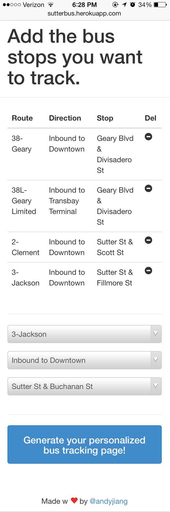
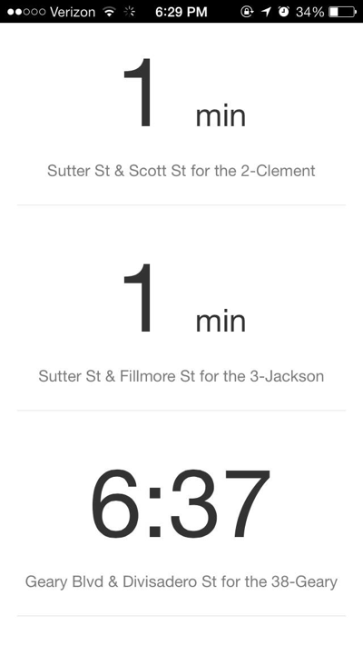

# Sutter Bus

Your personalized real-time bus tracker

If you take the muni on a daily basis, it can be a hassle checking bus prediction web sites/apps for your various routes and stops to get an estimation of when your next bus will arrive. This app requires one time setup, where you select the bus routes and the stops that you frequently take. It will then generate a unique URL (that you can book mark or save onto your phone) that will display real time prediction data for your selected routes and stops.

## How to use

Visit http://sutterbus.herokuapp.com/ either on your mobile Safari or on a desk top web browser. Select the routes and the bus stops that you primarily frequent. Hit the button and a unique web page will be generated for you.

Feel free to save this URL for your future use.

## Future ideas

- Sending a text to your phone with the predictions so you don't have to actively log onto the website
- From the website, selecting a 'bus' prediction time to receive a text message when that bus is within five minutes of your stop
- Allowing users to text the URL of the app to their phone

---------

I hope you find this useful. I am open to ideas and suggestions. Feel free to tweet at me @andyjiang.